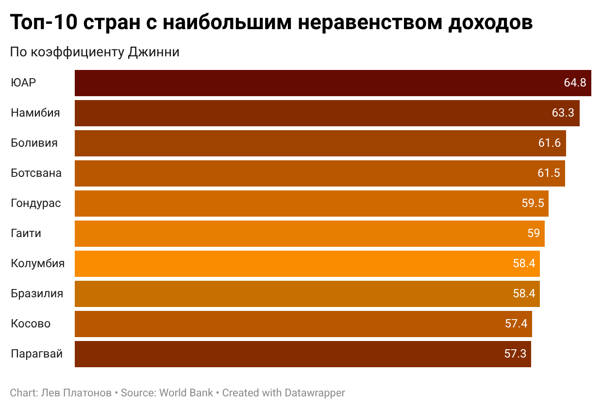
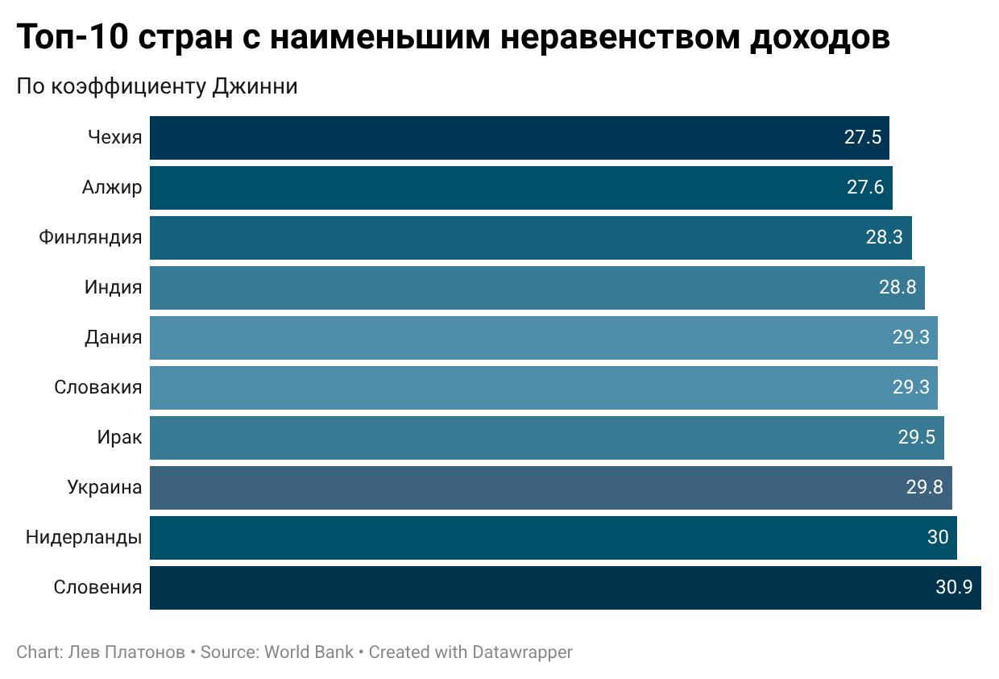
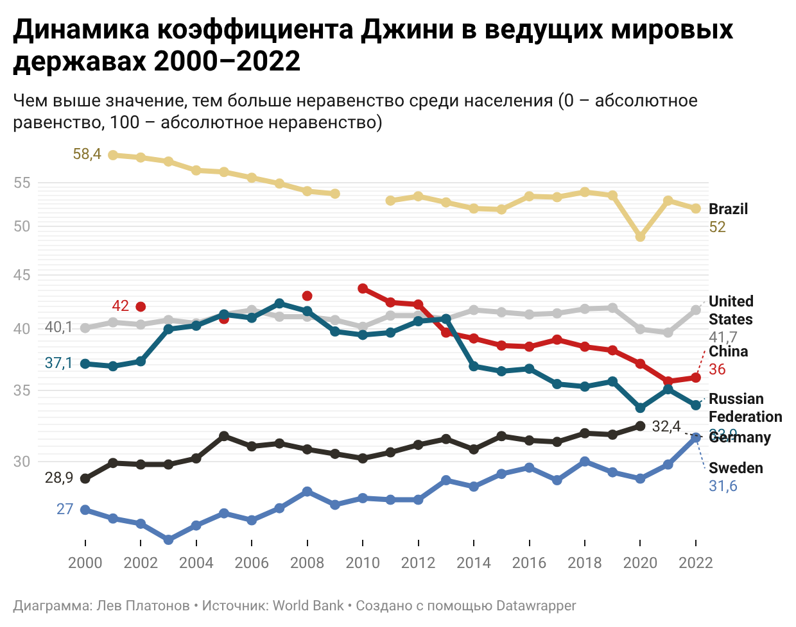
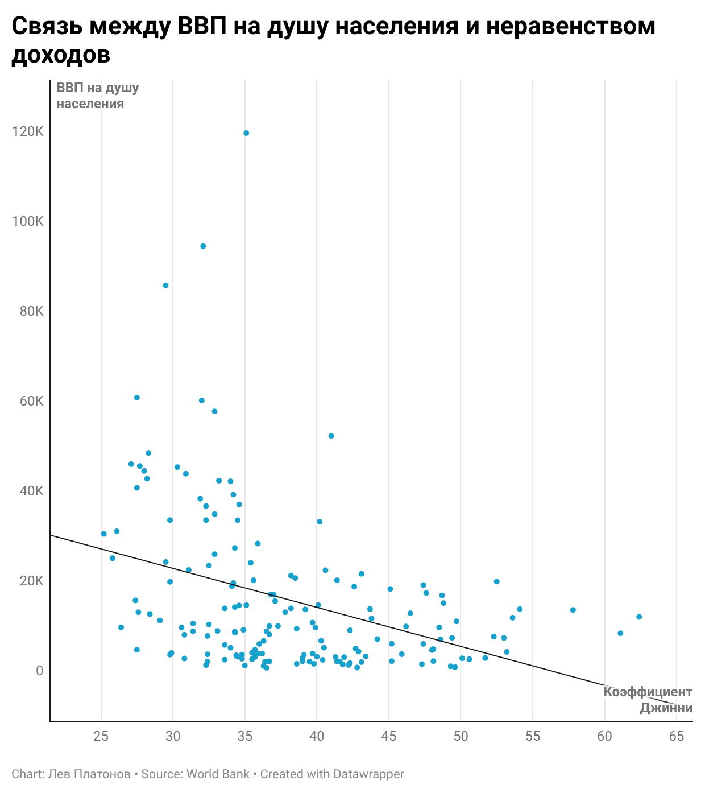

# 📊 Неравенство доходов в мире: анализ коэффициента Джини (2000–2022)

## Синопсис

В данном проекте проводится анализ динамики неравенства доходов в мире за период с 2000 по 2022 год на основе коэффициента Джини — стандартного международного показателя, где 0 означает абсолютное равенство, а 100 — абсолютное неравенство. Исследование охватывает 167 стран и позволяет проследить, как менялось неравенство в разных регионах мира, какие страны являются лидерами и аутсайдерами по этому показателю, а также существует ли связь между уровнем экономического развития страны и степенью неравенства среди её населения.

В ходе анализа было установлено, что наибольшее неравенство сосредоточено в странах Африки и Латинской Америки, тогда как наиболее равными остаются страны Центральной и Северной Европы. При этом высокий ВВП сам по себе не гарантирует низкого неравенства: США при одном из самых высоких уровней ВВП на душу населения в мире демонстрируют коэффициент Джини выше, чем большинство западноевропейских стран.

---

## Актуальность

Неравенство доходов — одна из ключевых проблем современной экономики. Разрыв между богатыми и бедными влияет на социальную стабильность, уровень преступности, доступность образования и здравоохранения, а также на политические процессы внутри стран. По данным Всемирного банка, даже в период глобального экономического роста 2000-х годов плоды этого роста распределялись крайне неравномерно как внутри стран, так и между ними. Понимание того, в каких странах и почему неравенство растёт или снижается, необходимо для разработки эффективной социальной и налоговой политики.

---

## Исследовательские вопросы

- Какие страны демонстрируют наибольшее и наименьшее неравенство доходов?
- Как изменился коэффициент Джини в ведущих мировых державах за период 2000–2022?
- Есть ли связь между уровнем ВВП на душу населения и степенью неравенства?
- Какие регионы мира являются наиболее и наименее равными?

---

## Данные

### Источники

| Показатель | Источник | Ссылка |
|---|---|---|
| Коэффициент Джини | World Bank, World Development Indicators | [data.worldbank.org](https://data.worldbank.org/indicator/SI.POV.GINI) |
| ВВП на душу населения (ППС, текущие межд. долл.) | World Bank, World Development Indicators | [data.worldbank.org](https://data.worldbank.org/indicator/NY.GDP.PCAP.PP.CD) |

Данные загружены в феврале 2026 года. Последнее обновление датасетов на стороне Всемирного банка — 24 февраля 2026 года.

### Процесс сбора и очистки

Исходные файлы были скачаны с портала Всемирного банка в формате CSV и импортированы в Google Таблицы. Оба файла поступают в **широком формате** (wide format): каждый год представлен отдельным столбцом. В ходе очистки были выполнены следующие шаги:

- удалены первые 4 строки с метаданными (источник, дата обновления)
- удалены столбцы с годами до 2000 и после 2022
- удалены строки с агрегированными показателями (регионы, группы стран по доходу), оставлены только отдельные страны
- данные преобразованы в **длинный формат** (long format): каждое наблюдение — отдельная строка с полями Country Name, Country Code, Year, Gini / GDP per capita
- пустые значения оставлены пустыми (не заменены нулём), поскольку отсутствие данных означает отсутствие замера, а не нулевое неравенство

Данные по коэффициенту Джини собираются нерегулярно: для многих стран доступно лишь 1–5 наблюдений за период 2000–2022. Для динамического анализа отобраны страны с 5 и более точками наблюдений. Для рейтинговых сравнений и scatter plot использовалось последнее доступное значение по каждой стране вне зависимости от года замера.

📁 Очищенные данные находятся в папке [`/data`](./data/)

---

## Анализ

### Описательная статистика

По всем 167 странам и всем наблюдениям за 2000–2022 годы:

| Показатель | Значение |
|---|---|
| Среднее значение Джини | 36.8 |
| Медиана | 35.0 |
| Минимум | 23.2 |
| Максимум | 64.8 |

Разброс между минимальным и максимальным значением составляет **41.6 пункта** — это говорит о колоссальных различиях в уровне неравенства между странами мира.

---

### Топ-10 стран с наибольшим неравенством

Лидером по неравенству является **ЮАР** с коэффициентом Джини 64.8 — один из самых высоких показателей в мире, унаследованный от эпохи апартеида. В топ-10 преобладают страны Африки (ЮАР, Намибия, Ботсвана) и Латинской Америки (Боливия, Гондурас, Гаити, Колумбия, Бразилия, Парагвай). Это устойчивая географическая закономерность: исторически сложившееся неравенство в доступе к земле, образованию и политической власти в этих регионах крайне сложно преодолеть.

---

### Топ-10 стран с наименьшим неравенством

Наиболее равными странами оказались **Чехия** (27.5) и **Алжир** (27.6). В числе лидеров равенства — страны Центральной Европы (Чехия, Словакия, Словения) и Скандинавии (Финляндия, Дания), что подтверждает эффективность их моделей перераспределения доходов через прогрессивное налогообложение и развитые системы социальной защиты. Присутствие Алжира и Украины в этом топе объясняется исторически плановым характером их экономик.

---

### Динамика коэффициента Джини в ведущих мировых державах

Для анализа динамики отобраны 6 стран, представляющих различные экономические модели:

| Страна | Модель | Джини в начале периода | Джини в конце периода | Изменение |
|---|---|---|---|---|
| 🇧🇷 Бразилия | Развивающийся рынок, Лат. Америка | 58.4 (2001) | 52.0 (2022) | −11.0% |
| 🇨🇳 Китай | Переходная экономика, быстрый рост | 42.0 (2002) | 36.0 (2022) | −14.3% |
| 🇩🇪 Германия | Континентальная европейская модель | 28.9 (2000) | 32.4 (2020) | +12.1% |
| 🇷🇺 Россия | Постсоветская экономика | 37.1 (2000) | 33.9 (2022) | −8.6% |
| 🇸🇪 Швеция | Скандинавская социальная модель | 27.0 (2000) | 31.6 (2022) | +17.0% |
| 🇺🇸 США | Либеральная англосаксонская модель | 40.1 (2000) | 41.7 (2022) | +4.0% |

**Ключевые наблюдения:**
- Китай и Бразилия продемонстрировали наибольшее снижение неравенства за период — несмотря на то что оба по-прежнему остаются среди наиболее неравных крупных экономик мира.
- Россия устойчиво снижала неравенство начиная с пика в 2007 году (42.3) и к 2022 достигла исторического минимума (33.9).
- США практически не изменились за 22 года, держась в диапазоне 39.7–41.9 — неравенство законсервировалось на высоком уровне.
- Швеция и Германия, напротив, показали рост Джини — даже социальные государства не застрахованы от роста неравенства под влиянием глобализации и притока миграции.

---

### Связь между ВВП на душу населения и неравенством доходов

Scatter plot по 167 странам демонстрирует **умеренную отрицательную зависимость**: богатые страны в целом более равны. Однако зависимость далеко не однозначна и распадается на три характерные группы:

- **Богатые и равные** (высокий ВВП, низкий Джини): Норвегия, Дания, Нидерланды, Финляндия, Швеция, Германия, Австрия — страны с развитыми системами перераспределения доходов.
- **Богатые и неравные** (высокий ВВП, высокий Джини): США и Израиль — страны с либеральной моделью налогообложения и меньшим объёмом социальных расходов.
- **Бедные и неравные** (низкий ВВП, высокий Джини): большинство стран Африки и Латинской Америки.

**Вывод:** высокий ВВП сам по себе не гарантирует низкого неравенства. Решающую роль играет модель распределения — прогрессивность налоговой системы и развитость социального государства. Это наглядно подтверждает сравнение США (ВВП ~52 000 долл., Джини ~41) и Германии (ВВП ~44 000 долл., Джини ~31).

---

## Ключевые выводы

1. **Географическая концентрация неравенства:** все 10 наиболее неравных стран расположены в Африке или Латинской Америке; все 10 наиболее равных — в Европе или на постсоветском пространстве.
2. **Конвергенция в развивающихся экономиках:** Китай, Бразилия и Россия за 2000–2022 годы снизили неравенство, тогда как развитые страны (США, Германия, Швеция) его нарастили — разрыв между группами постепенно сокращается.
3. **ВВП ≠ равенство:** США опровергают предположение о том, что богатство автоматически ведёт к равенству — при ВВП в 1.5 раза выше германского их Джини на 10 пунктов выше.
4. **Феномен 2020 года:** в год пандемии COVID-19 Бразилия зафиксировала резкое снижение Джини до 48.9 — аномально низкое значение для страны, объяснимое массовыми государственными выплатами малоимущим, которые временно сократили разрыв.
5. **Устойчивость неравенства:** несмотря на глобальный экономический рост, ни одной из наиболее неравных стран за 22 года не удалось опуститься ниже отметки 50 по Джини — структурное неравенство крайне инертно.

---

## Инструменты

- **Google Таблицы** — импорт, очистка, нормализация данных, описательный анализ, сводные таблицы
- **Datawrapper** — создание визуализаций
- **GitHub** — публикация и хранение проекта

---

## Референсы

- World Bank Poverty and Inequality Platform: https://pip.worldbank.org
- World Bank — Gini index indicator: https://data.worldbank.org/indicator/SI.POV.GINI
- World Bank — GDP per capita (PPP): https://data.worldbank.org/indicator/NY.GDP.PCAP.PP.CD
- Our World in Data — Economic Inequality: https://ourworldindata.org/economic-inequality
- Milanovic, B. (2016). *Global Inequality: A New Approach for the Age of Globalization*. Harvard University Press.
